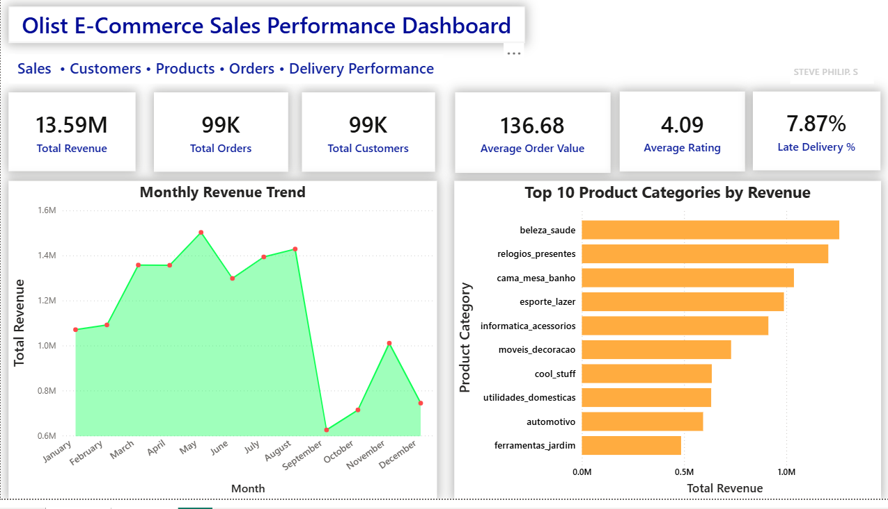
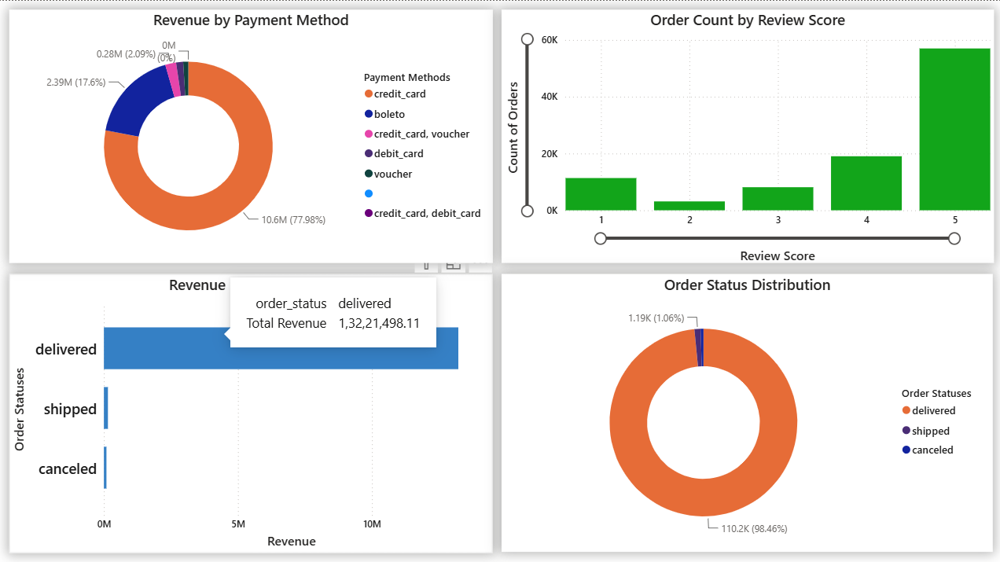

# 📊 Olist E-Commerce Sales Analytics Dashboard

An end-to-end Data Analytics project built using **Python** and **Power BI** to analyze the Olist Brazilian E-Commerce dataset. This project demonstrates a complete analytics workflow—from raw data preprocessing and feature engineering to interactive business intelligence dashboards.

---

## 📌 Project Overview

The objective of this project is to transform raw e-commerce transactional data into meaningful business insights through data cleaning, feature engineering, exploratory analysis, and interactive dashboarding.

The project follows an industry-standard analytics pipeline:

Raw Data → Data Cleaning → ETL → Feature Engineering → Power BI Dashboard → Business Insights

---

## 🎯 Business Objectives

- Analyze overall sales performance
- Identify top-performing product categories
- Evaluate customer purchasing behaviour
- Understand payment preferences
- Monitor order fulfilment performance
- Measure customer satisfaction through review scores

---




# 🛠 Tech Stack

### Programming

- Python
- Pandas
- NumPy

### Data Visualization

- Power BI
- DAX

### Development Tools

- Jupyter Notebook
- VS Code
- Git
- GitHub

---

# 📂 Project Structure

```
project/
│
├── data/
│   ├── raw/
│   ├── processed/
│   └── final_processed_datasets/
│
├── notebooks/
│   ├── 01_Data_Understanding.ipynb
│   ├── 02_Data_Cleaning_ETL.ipynb
│   ├── 03_Feature_Engineering.ipynb
│
├── powerbi/
│   └── Olist_Sales_Dashboard.pbix
│
├── dashboard_images/
│
├── README.md
│
└── requirements.txt
```

---

# ⚙️ Data Processing Pipeline

## 1. Data Understanding

- Dataset exploration
- Schema analysis
- Missing value identification
- Relationship understanding

---

## 2. Data Cleaning & ETL

Performed using Python.

Tasks included:

- Handling missing values
- Removing duplicates
- Data type conversion
- Merging multiple datasets
- Creating analytical fact tables

---

## 3. Feature Engineering

Created business-focused features including:

- Delivery Time
- Shipping Time
- Delivery Delay
- Late Delivery Flag
- Total Item Value
- Freight Percentage
- Product Volume
- Heavy Product Indicator
- Large Product Indicator
- Average Payment per Installment

---

# 📊 Power BI Dashboard

The dashboard was built using Power BI and DAX to provide interactive business insights.

### KPI Cards

- 💰 Total Revenue
- 📦 Total Orders
- 👥 Total Customers
- 💳 Average Order Value
- ⭐ Average Customer Rating
- 🚚 Late Delivery Percentage

---

### Dashboard Visuals

- Monthly Revenue Trend
- Top Product Categories by Revenue
- Revenue by Order Status
- Revenue by Payment Method
- Order Count by Review Score
- Order Status Distribution

---

# 📈 Key Business Insights

- Generated over **13.59 Million** in total revenue.
- Processed approximately **99K customer orders**.
- Average Order Value of **136.68**.
- Average customer rating of **4.09 / 5**.
- Approximately **7.87%** of orders experienced delivery delays.
- Credit Card payments accounted for the majority of transactions.
- Beauty & Health and Watches were among the highest revenue-generating product categories.

---

# 📷 Dashboard Preview

> Add screenshots of your dashboard here.

Example:

```
dashboard_images/dashboard.png
```

---

# 📚 Skills Demonstrated

### Python

- Data Cleaning
- ETL
- Feature Engineering
- Data Manipulation
- Business Metrics Calculation

### Power BI

- Data Modeling
- Relationships
- DAX Measures
- Interactive Dashboards
- KPI Design
- Business Storytelling

---

# 📊 DAX Measures Created

- Total Revenue
- Total Orders
- Total Customers
- Average Order Value
- Average Rating
- Late Delivery Percentage

---

# 🚀 Learning Outcomes

Through this project, I gained practical experience in:

- Designing an end-to-end analytics pipeline
- Building analytical datasets using Python
- Creating reusable business metrics with DAX
- Developing executive dashboards in Power BI
- Translating raw data into actionable business insights

---

# 📌 Future Improvements

- Add Date Dimension for advanced time intelligence
- Year-over-Year (YoY) Sales Analysis
- Month-over-Month Growth
- Customer Segmentation
- Geographic Sales Analysis
- Profitability Analysis
- Forecasting using Power BI

---

# 📄 Dataset

Dataset:
**Olist Brazilian E-Commerce Public Dataset**

Source:
https://www.kaggle.com/datasets/olistbr/brazilian-ecommerce

---

# 👨‍💻 Author

**Steve**

AI/ML Engineer | Data Analytics Enthusiast

GitHub: https://github.com/stevephilipgit

LinkedIn: www.linkedin.com/in/steve-p-25459021a

---
